# 員工入職流程優化 + 會計品牌分配管理

本文檔說明兩個新功能的實作和使用方式。

## 📋 目錄

1. [員工入職流程優化（方案 A）](#員工入職流程優化方案-a)
2. [會計品牌分配管理](#會計品牌分配管理)
3. [部署步驟](#部署步驟)
4. [使用指南](#使用指南)

---

## 員工入職流程優化（方案 A）

### 問題描述

**原有流程的痛點：**
- 先建立員工記錄
- 發送密碼重設信給員工
- 員工還沒重設密碼前，`user_id` 為 NULL
- 導致人員清冊不完整，無法正常使用

### 解決方案（方案 A）

**改善後的流程：**

```mermaid
graph LR
    A[HR 建立員工] --> B[使用 Admin API 創建帳號]
    B --> C[立即創建員工記錄並關聯 user_id]
    C --> D[發送密碼重設連結]
    D --> E[員工設定密碼]
```



**主要改動：**

1. **修改 Edge Function** (`supabase/functions/invite-employee/index.ts`)
   - 使用 `admin.createUser()` 取代 `inviteUserByEmail()`
   - 設定 `email_confirm: true` 自動確認信箱
   - 創建員工記錄時立即設定 `user_id`
   - 使用 `generateLink()` 生成密碼重設連結

2. **優點：**
   - ✅ 員工記錄和帳號同步創建
   - ✅ `user_id` 立即存在，人員清冊完整
   - ✅ 可以預先設定權限和角色
   - ✅ 員工可以自己設定密碼

3. **錯誤處理：**
   - Email 已存在時提供友善錯誤訊息
   - 員工記錄創建失敗時自動清理已創建的帳號
   - 密碼重設信發送失敗不影響帳號創建

### 程式碼變更

**Before (舊版):**
```typescript
// 使用 inviteUserByEmail
const { data: userData, error } = await supabaseAdmin.auth.admin.inviteUserByEmail(
  email,
  { data: { full_name: name } }
)

// 嘗試更新員工 (但員工記錄可能還不存在)
await supabaseAdmin
  .from('employees')
  .update({ ... })
  .eq('user_id', userData.user.id)
```

**After (新版):**
```typescript
// 1. 先創建帳號
const { data: userData, error } = await supabaseAdmin.auth.admin.createUser({
  email: email,
  email_confirm: true,  // 自動確認
  user_metadata: { full_name: name }
})

// 2. 立即創建員工記錄並關聯 user_id
await supabaseAdmin
  .from('employees')
  .insert({
    user_id: userData.user.id,  // 立即關聯
    employee_id: employee_id,
    name: name,
    // ... 其他欄位
  })

// 3. 發送密碼重設連結
await supabaseAdmin.auth.admin.generateLink({
  type: 'recovery',
  email: email
})
```

---

## 會計品牌分配管理

### 功能說明

允許 HR/Admin 在管理中心為會計人員分配負責的品牌。

**使用場景：**
- 六扇門會計只處理六扇門品牌的付款申請
- 其他會計處理其他品牌的付款申請
- 一個品牌可以分配給多位會計（共同處理）

### 資料庫結構

已在 `add_payment_system_enhancements.sql` 中創建：

```sql
-- 會計品牌關聯表
CREATE TABLE payment_approval.accountant_brands (
    id BIGSERIAL PRIMARY KEY,
    employee_id UUID NOT NULL REFERENCES public.employees(id),
    brand_id BIGINT NOT NULL REFERENCES payment_approval.brands(id),
    created_at TIMESTAMP WITH TIME ZONE DEFAULT NOW(),
    UNIQUE(employee_id, brand_id)  -- 防止重複分配
);
```

### 前端組件

**新增文件：**
- `src/pages/management/components/AccountantBrandsManagement.jsx`

**功能特性：**
- ✅ 顯示所有會計人員列表
- ✅ 顯示每位會計已分配的品牌
- ✅ 為會計添加/移除品牌
- ✅ 統計資訊（會計人數、品牌總數、分配關係）
- ✅ 即時生效，無需重新登入

**管理中心整合：**
- 在 `ManagementCenter.jsx` 新增「會計品牌分配」Tab
- 使用 `BadgeDollarSign` 圖標
- 只有 Admin 和 HR 可以訪問

### UI 截圖說明

管理介面包含：

1. **說明卡片**
   - 解釋功能用途
   - 提供使用範例

2. **統計資訊**
   - 會計人員總數
   - 品牌總數
   - 分配關係總數

3. **會計列表**
   - 每個會計顯示：
     - 姓名和 Email
     - 已分配品牌（彩色標籤）
     - 添加品牌的下拉選單

4. **操作**
   - 點擊 ❌ 移除品牌分配
   - 選擇品牌後點擊「添加」按鈕

### 權限設定

**RLS 策略：**
```sql
-- 會計可以查看自己負責的品牌
CREATE POLICY "會計可以查看自己負責的品牌"
    ON payment_approval.accountant_brands
    FOR SELECT
    USING (employee_id IN (
        SELECT id FROM public.employees WHERE user_id = auth.uid()
    ));

-- 管理員可以管理會計品牌
CREATE POLICY "管理員可以管理會計品牌"
    ON payment_approval.accountant_brands
    FOR ALL
    USING (
        EXISTS (
            SELECT 1 FROM public.employees
            WHERE user_id = auth.uid()
            AND role IN ('admin', 'hr')
        )
    );
```

---

## 部署步驟

### 1. 資料庫 Migration

如果尚未執行，請執行以下 migration：

```bash
# 本地開發環境
supabase db push

# 或者在 Supabase Dashboard 執行
# SQL Editor → 貼上 add_payment_system_enhancements.sql 內容 → Run
```

### 2. 部署 Edge Function

```bash
# 部署 invite-employee function
supabase functions deploy invite-employee

# 確認環境變數已設定
# SUPABASE_URL
# SUPABASE_SERVICE_ROLE_KEY
```

### 3. 前端部署

```bash
# 安裝依賴（如有新增）
npm install

# 構建並部署
npm run build
# 部署到 Vercel 或其他平台
```

### 4. 驗證配置

確認 `supabase/config.toml` 包含：

```toml
[api]
schemas = [
  "public",
  "payment_approval",  # 必須包含
  # ... 其他 schemas
]
```

---

## 使用指南

### HR 如何使用新的員工入職流程

1. **進入管理中心**
   - 登入系統
   - 點擊「管理中心」

2. **新增員工**
   - 切換到「員工資料」Tab
   - 點擊「新增員工」按鈕
   - 填寫員工資訊（必須包含 Email、姓名、員工編號）
   - 選擇角色（例如：會計）
   - 點擊「建立」

3. **系統自動處理**
   - ✅ 創建 Supabase 認證帳號
   - ✅ 創建員工記錄（`user_id` 立即有值）
   - ✅ 生成密碼重設連結
   - ✅ 回傳連結供 HR 發送給員工

4. **員工設定密碼**
   - 員工收到密碼重設連結
   - 點擊連結設定自己的密碼
   - 完成後即可登入系統

### 如何管理會計品牌分配

1. **進入品牌分配管理**
   - 登入管理中心（需要 Admin 或 HR 權限）
   - 切換到「會計品牌分配」Tab

2. **查看現有分配**
   - 頂部顯示統計資訊
   - 每位會計顯示已分配的品牌（彩色標籤）

3. **為會計添加品牌**
   - 找到要分配的會計
   - 在「添加品牌」下拉選單中選擇品牌
   - 點擊「添加」按鈕
   - ✅ 分配立即生效

4. **移除品牌分配**
   - 找到已分配的品牌標籤
   - 點擊標籤上的 ❌ 按鈕
   - 確認刪除
   - ✅ 移除立即生效

### 會計使用體驗

**分配品牌後：**
- 會計登入付款系統
- Dashboard 只顯示所負責品牌的待簽核案件
- 無法看到其他品牌的案件
- 分配設定即時生效，無需重新登入

**未分配品牌時：**
- 會計將看不到任何待簽核案件
- 系統會提示「無待處理案件」

---

## 注意事項

### 員工入職流程

⚠️ **重要提醒：**

1. **Email 必須唯一**
   - 如果 Email 已被使用，系統會返回友善錯誤訊息
   - 請使用公司 Email 或確保唯一性

2. **密碼重設連結**
   - 目前使用 `generateLink()` 生成連結
   - HR 需要手動將連結發送給員工
   - 可以考慮整合 Email 服務（Resend、SendGrid 等）自動發送

3. **員工信箱已自動確認**
   - 使用 `email_confirm: true`
   - 員工不需要點擊驗證信
   - 直接使用密碼重設連結設定密碼即可

4. **人員清冊完整性**
   - 新流程確保 `user_id` 立即存在
   - 員工記錄可以立即在各系統中使用
   - 不會出現「待啟用」的狀態

### 會計品牌分配

⚠️ **注意事項：**

1. **必須先指定角色**
   - 只有角色為「會計」的員工會出現在分配列表
   - 請先在「員工資料」Tab 設定正確的角色

2. **分配即時生效**
   - 不需要會計重新登入
   - 下次刷新 Dashboard 即可看到變更

3. **一個品牌可以分配給多位會計**
   - 支援多位會計共同處理同一品牌
   - 案件會對所有負責該品牌的會計可見

4. **未分配的會計**
   - 如果會計沒有分配任何品牌
   - 將無法在付款系統看到待簽核案件
   - 請確保每位會計至少分配一個品牌

5. **資料庫必須已執行 Migration**
   - 必須先執行 `add_payment_system_enhancements.sql`
   - 否則會出現「表不存在」錯誤

---

## 未來改進建議

### 員工入職流程

1. **自動發送 Email**
   - 整合 Resend 或 SendGrid
   - 自動發送密碼設定連結給新員工
   - 提供美觀的 Email 模板

2. **批量匯入**
   - 支援 CSV 批量匯入員工
   - 適合新公司入職季節

3. **入職進度追蹤**
   - 顯示員工是否已設定密碼
   - 顯示「待啟用」、「已啟用」狀態

### 會計品牌分配

1. **批量分配**
   - 支援一次為多位會計分配相同品牌
   - 適合組織重組時使用

2. **分配歷史記錄**
   - 記錄誰在何時修改了分配
   - 提供審計追蹤

3. **Dashboard 提示**
   - 未分配品牌的會計登入時顯示提示
   - 引導聯繫管理員進行分配

4. **品牌負責人統計**
   - 在品牌列表中顯示每個品牌的負責會計數量
   - 避免品牌無人負責的情況

---

## 技術細節

### Edge Function 錯誤處理

```typescript
// Email 已存在
if (createUserError.message.includes('already registered')) {
  throw new Error(`此 Email (${email}) 已被註冊...`)
}

// 員工記錄創建失敗，清理帳號
if (insertError) {
  await supabaseAdmin.auth.admin.deleteUser(userData.user.id)
  throw new Error(`建立員工記錄失敗: ${insertError.message}`)
}

// 密碼重設信發送失敗（不影響主流程）
if (recoveryError) {
  console.warn('Failed to send password reset email:', recoveryError.message)
  // 不拋出錯誤，只記錄警告
}
```

### 前端資料流

```javascript
// 獲取會計人員
const accountants = await supabase
  .from('employees')
  .select('*')
  .eq('role', 'accountant')
  .eq('status', 'active')

// 獲取品牌
const brands = await supabase
  .from('brands')
  .select('*')

// 獲取分配關係
const assignments = await supabase
  .from('accountant_brands')
  .select('*')

// 添加分配
await supabase
  .from('accountant_brands')
  .insert({
    employee_id: accountantId,
    brand_id: brandId
  })
```

---

## 問題排查

### 員工建立失敗

**症狀：** 點擊「建立」後顯示錯誤

**可能原因：**
1. Email 已被使用 → 更換 Email
2. Edge Function 未部署 → 執行 `supabase functions deploy invite-employee`
3. 環境變數未設定 → 檢查 `SUPABASE_SERVICE_ROLE_KEY`

### 會計品牌分配不顯示

**症狀：** 「會計品牌分配」Tab 沒有會計人員

**可能原因：**
1. 沒有角色為「會計」的員工 → 在「員工資料」中設定角色
2. 員工狀態不是「在職」→ 檢查員工狀態

### 品牌列表為空

**症狀：** 無法添加品牌（下拉選單為空）

**可能原因：**
1. `payment_approval.brands` 表沒有資料 → 先在付款系統建立品牌
2. Schema 未暴露 → 檢查 `config.toml` 中的 `schemas` 設定

### 會計看不到案件

**症狀：** 會計登入付款系統後 Dashboard 為空

**可能原因：**
1. 該會計沒有分配任何品牌 → 在管理中心進行分配
2. 沒有該品牌的待簽核案件 → 檢查是否有案件處於「待會計簽核」狀態
3. Dashboard 查詢邏輯未更新 → 確認已使用 `accountant_pending_requests` 視圖

---

## 聯絡與支援

如有問題，請聯繫：
- 系統管理員
- 開發團隊

相關文件：
- [付款系統升級指南](./PAYMENT_MULTI_STORE_UPGRADE.md)
- [Supabase 文檔](https://supabase.com/docs)
